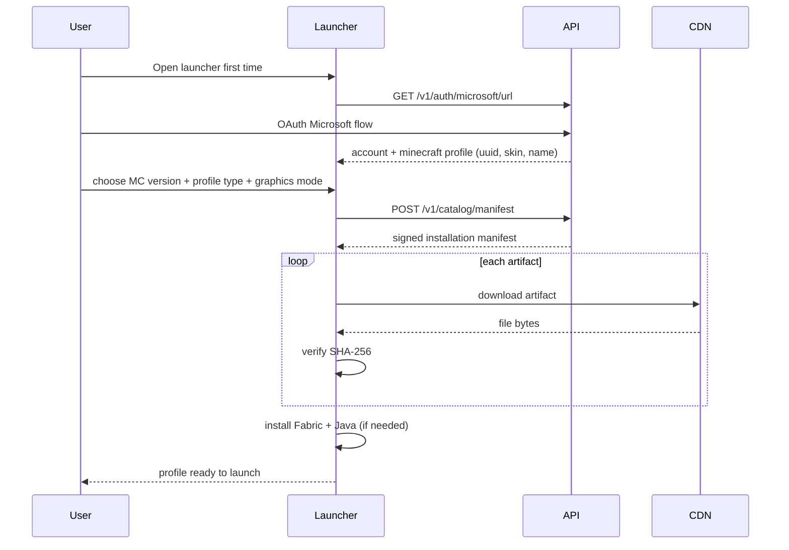

# First Setup - Sequence Diagram

```mermaid
sequenceDiagram
  participant U as User
  participant L as Launcher
  participant A as API
  participant C as CDN

  U->>L: Open launcher first time
  L->>A: GET /v1/auth/microsoft/url
  U->>A: OAuth Microsoft flow
  A-->>L: account + minecraft profile (uuid, skin, name)

  U->>L: choose MC version + profile type + graphics mode
  L->>A: POST /v1/catalog/manifest
  A-->>L: signed installation manifest

  loop each artifact
    L->>C: download artifact
    C-->>L: file bytes
    L->>L: verify SHA-256
  end

  L->>L: install Fabric + Java (if needed)
  L-->>U: profile ready to launch
```
